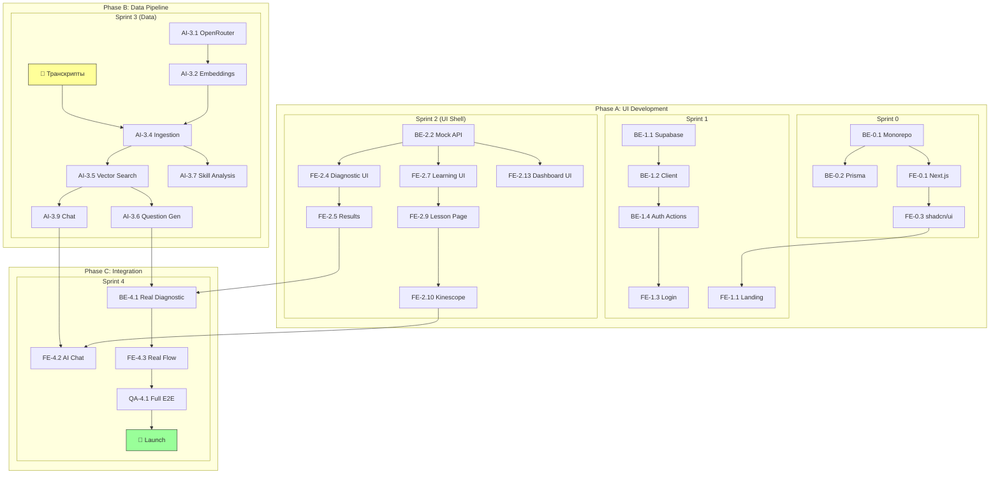

# Task Breakdown

**Проект:** MPSTATS Academy MVP  
**Версия:** 1.0  
**Дата:** 2025-12-18

---

## 1. Субагенты проекта

### 1.1 Определение ролей

| Субагент | Зона ответственности | Компетенции |
|----------|---------------------|-------------|
| **🏗️ BACKEND** | API, Database, Auth, RAG Pipeline | Node.js, PostgreSQL, Prisma, tRPC, OpenAI |
| **🎨 FRONTEND** | UI Components, Pages, State Management | React, Next.js, Tailwind, shadcn/ui |
| **🖌️ DESIGN** | UI/UX, Figma → Code, Design System | Figma, CSS, Accessibility |
| **🧪 QA** | Testing, Quality Gates | Vitest, Playwright, Manual Testing |
| **🤖 AI/ML** | RAG, Embeddings, Prompts, LLM Integration | OpenAI, pgvector, Prompt Engineering |

### 1.2 Взаимодействие субагентов

```
                    ┌─────────────────┐
                    │   PRODUCT       │
                    │   (Егор)        │
                    └────────┬────────┘
                             │
              ┌──────────────┼──────────────┐
              │              │              │
              ▼              ▼              ▼
     ┌─────────────┐  ┌─────────────┐  ┌─────────────┐
     │   DESIGN    │  │   BACKEND   │  │    AI/ML    │
     │   🖌️        │  │   🏗️        │  │    🤖       │
     └──────┬──────┘  └──────┬──────┘  └──────┬──────┘
            │                │                │
            │                │                │
            ▼                ▼                │
     ┌─────────────┐  ┌─────────────┐        │
     │  FRONTEND   │◀─│   tRPC      │◀───────┘
     │   🎨        │  │   Types     │
     └──────┬──────┘  └─────────────┘
            │
            ▼
     ┌─────────────┐
     │     QA      │
     │    🧪       │
     └─────────────┘
```

---

## 2. Sprint Planning (UI-First Approach)

### 2.1 Философия подхода

```
┌─────────────────────────────────────────────────────────────────────┐
│                         UI-FIRST DEVELOPMENT                        │
├─────────────────────────────────────────────────────────────────────┤
│                                                                     │
│   PHASE A: UI Development          PHASE B: Data & AI              │
│   (Sprint 0-2)                     (Sprint 3)                      │
│   ─────────────────                ─────────────                   │
│   • Mock data                      • Транскрипты                   │
│   • Все экраны готовы              • Embeddings                    │
│   • Кликабельный прототип          • RAG pipeline                  │
│                                    • Skill Graph                   │
│              │                              │                      │
│              └──────────┬───────────────────┘                      │
│                         │                                          │
│                  Sprint 4: Integration                             │
│                  ─────────────────────                             │
│                  • Подключение реальных данных                     │
│                  • Polish & QA                                     │
│                  • Launch                                          │
│                                                                     │
└─────────────────────────────────────────────────────────────────────┘
```

**Параллельная работа:**
- Пока идёт Phase A (UI) → Егор готовит транскрипты курсов
- Sprint 3 (Data) можно начать параллельно со Sprint 2 или после него

### 2.2 Sprint Overview

| Sprint | Weeks | Focus | Блокер от данных? |
|--------|-------|-------|-------------------|
| **Sprint 0** | 0.5 | Setup | ❌ Нет |
| **Sprint 1** | 1.5 | Auth + Landing | ❌ Нет |
| **Sprint 2** | 2 | UI Shell (все экраны на mock) | ❌ Нет |
| **Sprint 3** | 2 | Data Pipeline + RAG | ⚠️ Нужны транскрипты |
| **Sprint 4** | 1.5 | Integration + Polish | ✅ Всё готово |

### 2.3 Что нужно от Егора и когда

| Дедлайн | Что нужно | Для чего |
|---------|-----------|----------|
| Sprint 0 | Figma дизайн-система | UI разработка |
| Sprint 1 | Supabase проект создан | Auth работает |
| Sprint 2 | Kinescope аккаунт + 1 тестовое видео | Проверка плеера |
| **Sprint 3** | **Транскрипты курсов** | RAG pipeline |
| Sprint 3 | Структура курсов (JSON) | Seed database |

---

## 3. Detailed Task Breakdown

### Sprint 0: Project Setup (3-4 дня)

#### 🏗️ BACKEND Tasks

| ID | Task | Description | Files | Est | Deps |
|----|------|-------------|-------|-----|------|
| BE-0.1 | Init monorepo | Turborepo + packages structure | `turbo.json`, `package.json` | 2h | - |
| BE-0.2 | Setup Prisma | Schema, DB connection, pgvector | `packages/db/*` | 3h | BE-0.1 |
| BE-0.3 | Setup tRPC | Base router, context, types | `packages/api/*` | 3h | BE-0.1 |
| BE-0.4 | Docker Compose | PostgreSQL + pgvector local | `docker-compose.yml` | 1h | - |
| BE-0.5 | ENV template | Environment variables template | `.env.example` | 0.5h | - |

#### 🎨 FRONTEND Tasks

| ID | Task | Description | Files | Est | Deps |
|----|------|-------------|-------|-----|------|
| FE-0.1 | Init Next.js | App Router setup, layouts | `apps/web/*` | 2h | BE-0.1 |
| FE-0.2 | Setup Tailwind | Config, base styles | `tailwind.config.ts`, `globals.css` | 1h | FE-0.1 |
| FE-0.3 | Setup shadcn/ui | Init, base components | `components/ui/*` | 2h | FE-0.2 |
| FE-0.4 | tRPC Client | React Query + tRPC integration | `lib/trpc/*` | 2h | BE-0.3 |

#### 🖌️ DESIGN Tasks

| ID | Task | Description | Files | Est | Deps |
|----|------|-------------|-------|-----|------|
| DS-0.1 | Design Tokens | Colors, typography, spacing | `tailwind.config.ts` | 2h | Figma |
| DS-0.2 | Base Components | Button, Input, Card specs | Figma export | 3h | DS-0.1 |

#### 🧪 QA Tasks

| ID | Task | Description | Files | Est | Deps |
|----|------|-------------|-------|-----|------|
| QA-0.1 | Setup Vitest | Unit test config | `vitest.config.ts` | 1h | BE-0.1 |
| QA-0.2 | Setup Playwright | E2E test config | `playwright.config.ts` | 1h | FE-0.1 |
| QA-0.3 | CI Pipeline | GitHub Actions for tests | `.github/workflows/*` | 2h | QA-0.1, QA-0.2 |

---

### Sprint 1: Foundation (1.5 недели)

#### 🏗️ BACKEND Tasks

| ID | Task | Description | Files | Est | Deps |
|----|------|-------------|-------|-----|------|
| BE-1.1 | Supabase project setup | Create project, enable pgvector | Supabase Dashboard | 1h | - |
| BE-1.2 | Supabase client setup | Server + browser clients | `lib/supabase/*` | 2h | BE-1.1 |
| BE-1.3 | UserProfile model | Prisma schema + trigger | `schema.prisma`, SQL | 2h | BE-0.2, BE-1.1 |
| BE-1.4 | Auth actions | signUp, signIn, signOut, reset | `lib/auth/actions.ts` | 3h | BE-1.2 |
| BE-1.5 | Google OAuth setup | Supabase provider config | Supabase Dashboard | 1h | BE-1.1 |
| BE-1.6 | Auth callback route | OAuth callback handler | `app/auth/callback/route.ts` | 1h | BE-1.4 |
| BE-1.7 | Protected middleware | Route protection | `middleware.ts` | 2h | BE-1.2 |
| BE-1.8 | tRPC context with auth | User from Supabase session | `packages/api/trpc.ts` | 2h | BE-1.2, BE-0.3 |
| BE-1.9 | Profile router | Get/update profile basics | `routers/profile.ts` | 2h | BE-1.3 |

#### 🎨 FRONTEND Tasks

| ID | Task | Description | Files | Est | Deps |
|----|------|-------------|-------|-----|------|
| FE-1.1 | Landing page | Hero, Features, CTA | `app/page.tsx` | 6h | DS-1.1 |
| FE-1.2 | Auth layout | Shared layout for auth pages | `app/(auth)/layout.tsx` | 1h | FE-0.3 |
| FE-1.3 | Login page | Form, validation, errors | `app/(auth)/login/page.tsx` | 4h | BE-1.2, FE-1.2 |
| FE-1.4 | Register page | Form, validation, email sent | `app/(auth)/register/page.tsx` | 4h | BE-1.5, FE-1.2 |
| FE-1.5 | Verify email page | Confirmation screen | `app/(auth)/verify/page.tsx` | 2h | BE-1.5 |
| FE-1.6 | Password reset pages | Request + Reset forms | `app/(auth)/reset/*` | 3h | BE-1.6 |
| FE-1.7 | Main layout | Nav, sidebar, user menu | `app/(main)/layout.tsx` | 4h | BE-1.8 |
| FE-1.8 | Empty dashboard | Placeholder + redirect logic | `app/(main)/dashboard/page.tsx` | 2h | FE-1.7 |

#### 🖌️ DESIGN Tasks

| ID | Task | Description | Files | Est | Deps |
|----|------|-------------|-------|-----|------|
| DS-1.1 | Landing design | Hero, sections mockup | Figma | 4h | DS-0.2 |
| DS-1.2 | Auth pages design | Login, Register, Reset | Figma | 3h | DS-0.2 |
| DS-1.3 | Navigation design | Header, sidebar, mobile | Figma | 3h | DS-0.2 |

#### 🧪 QA Tasks

| ID | Task | Description | Files | Est | Deps |
|----|------|-------------|-------|-----|------|
| QA-1.1 | Supabase auth tests | Sign up, sign in, session | `tests/integration/auth.test.ts` | 3h | BE-1.4 |
| QA-1.2 | Auth E2E tests | Login, register, OAuth flow | `tests/e2e/auth.spec.ts` | 4h | FE-1.4, FE-1.6 |
| QA-1.3 | Landing E2E | Page loads, CTA works | `tests/e2e/landing.spec.ts` | 1h | FE-1.1 |
| QA-1.4 | Protected routes test | Redirect without auth | `tests/e2e/protected.spec.ts` | 2h | BE-1.7 |

---

### Sprint 2: UI Shell — Все экраны на Mock Data (2 недели)

> **Цель:** Полностью кликабельный прототип без реальных данных

#### 🏗️ BACKEND Tasks

| ID | Task | Description | Files | Est | Deps |
|----|------|-------------|-------|-----|------|
| BE-2.1 | Mock data types | TypeScript types для всех entities | `packages/shared/types/*` | 2h | - |
| BE-2.2 | Mock API layer | tRPC routers возвращающие mock data | `packages/api/mocks/*` | 4h | BE-2.1 |
| BE-2.3 | Diagnostic mock router | Fake questions, fake results | `routers/diagnostic.ts` | 3h | BE-2.2 |
| BE-2.4 | Learning mock router | Fake courses, lessons, progress | `routers/learning.ts` | 3h | BE-2.2 |
| BE-2.5 | Profile mock router | Fake dashboard data | `routers/profile.ts` | 2h | BE-2.2 |
| BE-2.6 | Course/Lesson models | Prisma schema (без chunks) | `schema.prisma` | 2h | - |
| BE-2.7 | Seed mock courses | 3 курса, 10 уроков для UI | `scripts/seed/mockCourses.ts` | 2h | BE-2.6 |

#### 🎨 FRONTEND Tasks

| ID | Task | Description | Files | Est | Deps |
|----|------|-------------|-------|-----|------|
| **Diagnostic UI** |
| FE-2.1 | Diagnostic intro page | Описание, CTA начать | `app/(main)/diagnostic/page.tsx` | 3h | DS-2.1 |
| FE-2.2 | Question component | MC/TF, выбор ответа | `components/diagnostic/Question.tsx` | 4h | DS-2.2 |
| FE-2.3 | Progress bar | Анимированный прогресс | `components/diagnostic/ProgressBar.tsx` | 2h | - |
| FE-2.4 | Diagnostic session page | Поток вопросов (mock) | `app/(main)/diagnostic/session/page.tsx` | 5h | FE-2.2, BE-2.3 |
| FE-2.5 | Results page | Radar chart, gap list | `app/(main)/diagnostic/results/page.tsx` | 5h | DS-2.3 |
| FE-2.6 | Radar chart component | Recharts 5-axis | `components/charts/RadarChart.tsx` | 4h | - |
| **Learning UI** |
| FE-2.7 | Learning path page | Список уроков, фильтры | `app/(main)/learn/page.tsx` | 4h | DS-3.1, BE-2.4 |
| FE-2.8 | Lesson card | Статус, категория, время | `components/learning/LessonCard.tsx` | 3h | DS-3.2 |
| FE-2.9 | Lesson page layout | Video + sidebar | `app/(main)/learn/[id]/page.tsx` | 5h | DS-3.3 |
| FE-2.10 | Kinescope player | Embed + progress events | `components/learning/KinescopePlayer.tsx` | 5h | Kinescope account |
| FE-2.11 | AI panels (placeholder) | Summary + Chat UI (пока static) | `components/learning/AIPanels.tsx` | 4h | DS-3.4 |
| FE-2.12 | Lesson completion | CTA следующий урок | `components/learning/CompletionCard.tsx` | 2h | - |
| **Dashboard UI** |
| FE-2.13 | Dashboard page | Progress, stats, radar | `app/(main)/dashboard/page.tsx` | 5h | DS-4.1, BE-2.5 |
| FE-2.14 | Stats cards | Уроки, время, уровень | `components/dashboard/StatsCards.tsx` | 3h | - |
| FE-2.15 | Recent activity | Последние уроки | `components/dashboard/RecentActivity.tsx` | 2h | - |
| **Profile UI** |
| FE-2.16 | Profile settings page | Имя, аватар, пароль | `app/(main)/profile/page.tsx` | 4h | DS-4.2 |
| FE-2.17 | Diagnostic history | Список прошлых (mock) | `app/(main)/profile/history/page.tsx` | 3h | - |

#### 🖌️ DESIGN Tasks

| ID | Task | Description | Files | Est | Deps |
|----|------|-------------|-------|-----|------|
| DS-2.1 | Diagnostic intro | Welcome screen | Figma | 2h | - |
| DS-2.2 | Question card | Layout, states | Figma | 3h | - |
| DS-2.3 | Results screen | Radar, recommendations | Figma | 4h | - |
| DS-3.1 | Learning path | Track view | Figma | 3h | - |
| DS-3.2 | Lesson card | States, mobile | Figma | 2h | - |
| DS-3.3 | Lesson page | Video + sidebar | Figma | 4h | - |
| DS-3.4 | AI panels | Summary, chat | Figma | 3h | - |
| DS-4.1 | Dashboard | Stats layout | Figma | 3h | - |
| DS-4.2 | Profile | Settings page | Figma | 2h | - |

#### 🧪 QA Tasks

| ID | Task | Description | Files | Est | Deps |
|----|------|-------------|-------|-----|------|
| QA-2.1 | UI Component tests | Storybook / Vitest | `tests/components/*` | 4h | FE-2.6 |
| QA-2.2 | Diagnostic flow E2E | Start → Complete (mock) | `tests/e2e/diagnostic.spec.ts` | 3h | FE-2.5 |
| QA-2.3 | Learning flow E2E | View lesson → Complete | `tests/e2e/learning.spec.ts` | 3h | FE-2.12 |
| QA-2.4 | Responsive testing | All pages on mobile | Manual | 4h | FE-2.17 |
| QA-2.5 | Accessibility audit | Lighthouse, keyboard | Report | 3h | - |

**Sprint 2 Deliverable:** Полностью кликабельный UI, можно демонстрировать stakeholders

---

### Sprint 2.5: UI Redesign — Брендинг MPSTATS Academy (1 неделя)

> **Цель:** Натянуть официальный дизайн MPSTATS Academy на существующий UI
> **Блокер:** ❌ Нет (можно делать параллельно с ожиданием транскриптов)
> **Приоритет:** 🔴 Высокий — улучшает восприятие продукта для демо

#### 📁 Источники дизайна

| Источник | URL | Что брать |
|----------|-----|-----------|
| **Цвета (Brand UI Kit)** | `https://wheel-next-22559505.figma.site/` | Полная палитра, токены, примеры использования |
| **Лендинг Редизайн** | `https://www.figma.com/design/ltQb2GRetrS17SDzjSudOX/` | Вкладка "Главная редизайн", пространства UI и MAIN |
| **Гайдлайн (старый)** | `https://www.figma.com/design/OmBVlWAJYzUKV3yQHywFMo/` | Логотип, базовые элементы |

#### 🎨 Цветовая палитра (из Brand UI Kit)

**Primary Blue Scale:**
| Token | Hex | Использование |
|-------|-----|---------------|
| `blue-50` | `#E8ECFE` | Soft background (info cards) |
| `blue-100` | `#D1DAFD` | Light backgrounds |
| `blue-200` | `#A3B5FB` | Borders, dividers |
| `blue-300` | `#7590FA` | Secondary buttons |
| `blue-400` | `#4768F8` | Hover states |
| `blue-500` | `#2C4FF8` | **Primary buttons, links** |
| `blue-600` | `#233FC6` | Active states |
| `blue-700` | `#1A2F95` | Dark text on light |
| `blue-800` | `#122063` | Headings |
| `blue-900` | `#091032` | Body text |

**Accent Green Scale:**
| Token | Hex | Использование |
|-------|-----|---------------|
| `green-50` | `#F3FEE7` | Success background |
| `green-100` | `#E7FDCF` | Light success |
| `green-200` | `#CFFB9F` | Success borders |
| `green-400` | `#9FF73F` | Success hover |
| `green-500` | `#87F50F` | **Success buttons, badges** |
| `green-600` | `#6CC40C` | Success active |

**Accent Pink Scale:**
| Token | Hex | Использование |
|-------|-----|---------------|
| `pink-50` | `#FEF0F4` | Featured background |
| `pink-200` | `#FCA3D3` | Light accent |
| `pink-500` | `#FF168A` | **Featured, Hot badges** |
| `pink-600` | `#CC125F` | Active state |

**Neutral Gray Scale:**
| Token | Hex | Использование |
|-------|-----|---------------|
| `gray-50` | `#F9FAFB` | Page background |
| `gray-100` | `#F3F4F6` | Card background |
| `gray-200` | `#E5E7EB` | Borders |
| `gray-400` | `#9CA3AF` | Placeholder text |
| `gray-500` | `#6B7280` | Secondary text |
| `gray-700` | `#374151` | Body text |
| `gray-900` | `#111827` | Headings |

**Gradient:**
| Name | Value | Использование |
|------|-------|---------------|
| `accent-gradient` | `linear-gradient(90deg, #CCFF96 0%, #CEFFF4 100%)` | Featured cards, CTAs |

#### 🖌️ DESIGN Tasks (Redesign)

| ID | Task | Description | Files | Est | Deps |
|----|------|-------------|-------|-----|------|
| **Фаза 1: Токены и база** |
| RD-1.1 | Tailwind config | Добавить все цвета из палитры | `tailwind.config.ts` | 2h | - |
| RD-1.2 | CSS variables | CSS custom properties для тем | `globals.css` | 1h | RD-1.1 |
| RD-1.3 | Typography | Шрифты, размеры, line-height | `tailwind.config.ts`, `globals.css` | 1h | RD-1.1 |
| RD-1.4 | Shadows & borders | Box-shadow, border-radius из UI Kit | `tailwind.config.ts` | 0.5h | RD-1.1 |
| **Фаза 2: Базовые компоненты** |
| RD-2.1 | Button redesign | Primary (blue), Success (green), Featured (pink) | `components/ui/button.tsx` | 2h | RD-1.1 |
| RD-2.2 | Card redesign | Soft Blue, Soft Green, Neutral White, Gradient | `components/ui/card.tsx` | 2h | RD-1.1 |
| RD-2.3 | Badge redesign | Premium, New, Hot, Featured, Limited, status badges | `components/ui/badge.tsx` | 2h | RD-1.1 |
| RD-2.4 | Input redesign | Focus states, validation colors | `components/ui/input.tsx` | 1h | RD-1.1 |
| RD-2.5 | Logo integration | Добавить логотип из Гайдлайна | `components/shared/Logo.tsx` | 1h | Figma |
| **Фаза 3: Layout компоненты** |
| RD-3.1 | Sidebar redesign | Новые цвета, hover states | `components/shared/Sidebar.tsx` | 2h | RD-2.1 |
| RD-3.2 | Header redesign | Logo, навигация, user menu | `components/shared/Header.tsx` | 2h | RD-2.5 |
| RD-3.3 | Mobile nav | Адаптация под новый дизайн | `components/shared/MobileNav.tsx` | 1h | RD-3.1 |
| **Фаза 4: Страницы** |
| RD-4.1 | Landing page | Hero, Features, CTA в новом стиле | `app/page.tsx` | 3h | RD-2.1, RD-2.2 |
| RD-4.2 | Auth pages | Login, Register, Reset в новом стиле | `app/(auth)/*` | 2h | RD-2.1, RD-2.4 |
| RD-4.3 | Dashboard | Cards, stats в новом стиле | `app/(main)/dashboard/page.tsx` | 2h | RD-2.2, RD-2.3 |
| RD-4.4 | Diagnostic pages | Intro, session, results | `app/(main)/diagnostic/*` | 2h | RD-2.1, RD-2.2 |
| RD-4.5 | Learning pages | Course cards, lesson page | `app/(main)/learn/*` | 2h | RD-2.2, RD-2.3 |
| RD-4.6 | Profile pages | Settings, history | `app/(main)/profile/*` | 1h | RD-2.2 |
| **Фаза 5: Полировка** |
| RD-5.1 | Radar chart | Цвета осей под новую палитру | `components/charts/RadarChart.tsx` | 1h | RD-1.1 |
| RD-5.2 | Lesson cards | Категории с новыми badge цветами | `components/learning/LessonCard.tsx` | 1h | RD-2.3 |
| RD-5.3 | Icons consistency | Проверить иконки на соответствие | All pages | 1h | - |
| RD-5.4 | Responsive check | Проверить адаптив после изменений | All pages | 2h | RD-4.* |

#### 📊 Effort Summary (Redesign)

| Фаза | Задачи | Часы |
|------|--------|------|
| Фаза 1: Токены и база | RD-1.1 — RD-1.4 | 4.5h |
| Фаза 2: Базовые компоненты | RD-2.1 — RD-2.5 | 8h |
| Фаза 3: Layout | RD-3.1 — RD-3.3 | 5h |
| Фаза 4: Страницы | RD-4.1 — RD-4.6 | 12h |
| Фаза 5: Полировка | RD-5.1 — RD-5.4 | 5h |
| **Total** | **20 задач** | **~34.5h** |

#### 🔄 Порядок выполнения

```
Фаза 1 (база)
    │
    ▼
┌───────────────────────────────────┐
│         Фаза 2 (компоненты)       │
│  Button → Card → Badge → Input    │
└───────────────────────────────────┘
    │
    ▼
┌───────────────────────────────────┐
│         Фаза 3 (layout)           │
│  Sidebar → Header → MobileNav     │
└───────────────────────────────────┘
    │
    ▼
┌───────────────────────────────────┐
│         Фаза 4 (страницы)         │
│  Landing → Auth → Dashboard →     │
│  Diagnostic → Learning → Profile  │
└───────────────────────────────────┘
    │
    ▼
Фаза 5 (полировка)
```

**Sprint 2.5 Deliverable:** UI полностью соответствует брендингу MPSTATS Academy

---

### Sprint 3: Data Pipeline — RAG & AI (2 недели)

> **Цель:** Полноценный RAG pipeline, генерация вопросов, AI-функции
> **Блокер:** Нужны транскрипты курсов от Егора

#### 🤖 AI/ML Tasks

| ID | Task | Description | Files | Est | Deps |
|----|------|-------------|-------|-----|------|
| AI-3.1 | OpenRouter client | Unified LLM client | `packages/ai/llm/openrouter.ts` | 2h | - |
| AI-3.2 | Embedding service | OpenRouter → OpenAI embeddings | `packages/ai/embeddings/embed.ts` | 2h | AI-3.1 |
| AI-3.3 | Chunking logic | Transcript → chunks + timecodes | `packages/ai/embeddings/chunker.ts` | 4h | - |
| AI-3.4 | Ingestion CLI | Process transcripts → DB | `scripts/ingest/cli.ts` | 6h | AI-3.2, AI-3.3 |
| AI-3.5 | Vector search | pgvector similarity | `packages/ai/retrieval/search.ts` | 4h | AI-3.4 |
| AI-3.6 | Question generation | Prompts + LLM | `packages/ai/generation/questions.ts` | 6h | AI-3.5 |
| AI-3.7 | Skill Graph Analysis | Extract skills from content | `scripts/analyze-skills/*` | 4h | AI-3.4 |
| AI-3.8 | Lesson summary | Prompt + caching | `packages/ai/generation/summary.ts` | 4h | AI-3.5 |
| AI-3.9 | Chat completion | RAG + response | `packages/ai/generation/chat.ts` | 6h | AI-3.5 |
| AI-3.10 | Citation extraction | Timecodes in responses | `packages/ai/generation/citations.ts` | 3h | AI-3.9 |

**AI-3.7 Skill Graph Analysis Output:**
```
skills_report.json     — какие навыки покрыты контентом
coverage_matrix.csv    — навык × урок
recommendations.md     — корректировки осей если нужны
```

#### 🏗️ BACKEND Tasks

| ID | Task | Description | Files | Est | Deps |
|----|------|-------------|-------|-----|------|
| BE-3.1 | ContentChunk model | Prisma + pgvector | `schema.prisma` | 2h | - |
| BE-3.2 | Diagnostic models | Session, Answer, SkillProfile | `schema.prisma` | 2h | - |
| BE-3.3 | Real diagnostic router | Replace mock → real AI | `routers/diagnostic.ts` | 6h | AI-3.6 |
| BE-3.4 | Skill calculation | Calculate profile from answers | `lib/diagnostic/scoring.ts` | 4h | BE-3.3 |
| BE-3.5 | Path generation | LearningPath from gaps | `lib/learning/pathGenerator.ts` | 5h | BE-3.4, AI-3.7 |
| BE-3.6 | AI router | Summary, chat endpoints | `routers/ai.ts` | 5h | AI-3.8, AI-3.9 |
| BE-3.7 | Chat rate limiting | 20 msg/hour | `middleware/rateLimit.ts` | 2h | - |
| BE-3.8 | Summary caching | Cache in SummaryCache table | `routers/ai.ts` | 2h | BE-3.6 |

#### 🧪 QA Tasks

| ID | Task | Description | Files | Est | Deps |
|----|------|-------------|-------|-----|------|
| QA-3.1 | Chunking tests | Verify chunk quality | `tests/unit/chunker.test.ts` | 2h | AI-3.3 |
| QA-3.2 | Retrieval tests | Top-k relevance | `tests/unit/retrieval.test.ts` | 3h | AI-3.5 |
| QA-3.3 | Question gen tests | Golden set (50 questions) | `tests/integration/questions.test.ts` | 4h | AI-3.6 |
| QA-3.4 | Chat quality tests | Response relevance | `tests/integration/chat.test.ts` | 3h | AI-3.9 |
| QA-3.5 | Hallucination check | All answers have citations | `tests/integration/citations.test.ts` | 3h | AI-3.10 |

**Sprint 3 Deliverable:** RAG работает, вопросы генерируются, AI-чат отвечает

---

### Sprint 4: Integration & Polish (1.5 недели)

> **Цель:** Соединить UI с реальными данными, финальный QA, запуск

#### 🏗️ BACKEND Tasks

| ID | Task | Description | Files | Est | Deps |
|----|------|-------------|-------|-----|------|
| BE-4.1 | Replace mock → real | Diagnostic router с AI | `routers/diagnostic.ts` | 3h | Sprint 3 |
| BE-4.2 | Replace mock → real | Learning router с RAG | `routers/learning.ts` | 3h | Sprint 3 |
| BE-4.3 | Real progress tracking | DB persistence | `routers/learning.ts` | 2h | BE-4.2 |
| BE-4.4 | Dashboard aggregations | Real stats queries | `routers/profile.ts` | 3h | BE-4.3 |
| BE-4.5 | Seed production data | Real courses structure | `scripts/seed/production.ts` | 3h | - |

#### 🎨 FRONTEND Tasks

| ID | Task | Description | Files | Est | Deps |
|----|------|-------------|-------|-----|------|
| FE-4.1 | AI Summary integration | Real API, streaming | `components/learning/SummaryPanel.tsx` | 3h | BE-3.6 |
| FE-4.2 | AI Chat integration | Real API, streaming | `components/learning/LessonChat.tsx` | 4h | BE-3.6 |
| FE-4.3 | Real diagnostic flow | Replace mock questions | `app/(main)/diagnostic/session/*` | 3h | BE-4.1 |
| FE-4.4 | Real learning path | From actual SkillProfile | `app/(main)/learn/*` | 3h | BE-4.2 |
| FE-4.5 | Error states | API errors, empty states | `components/shared/*` | 3h | - |
| FE-4.6 | Loading states | Skeletons everywhere | `components/ui/Skeleton.tsx` | 2h | - |
| FE-4.7 | Mobile nav polish | Responsive fixes | `components/shared/MobileNav.tsx` | 2h | - |
| FE-4.8 | Performance optimization | Images, lazy loading | Various | 3h | - |

#### 🧪 QA Tasks

| ID | Task | Description | Files | Est | Deps |
|----|------|-------------|-------|-----|------|
| QA-4.1 | Full flow E2E | Register → Diagnostic → Learn → Complete | `tests/e2e/fullFlow.spec.ts` | 5h | FE-4.4 |
| QA-4.2 | AI Chat E2E | Real responses, citations | `tests/e2e/chat.spec.ts` | 3h | FE-4.2 |
| QA-4.3 | Mobile testing | All flows on devices | Manual | 4h | - |
| QA-4.4 | Cross-browser | Chrome, Safari, Firefox | Manual | 3h | - |
| QA-4.5 | Performance audit | Lighthouse, Web Vitals | Report | 2h | FE-4.8 |
| QA-4.6 | Accessibility audit | WCAG AA compliance | Report | 3h | - |
| QA-4.7 | Security review | Auth, rate limits, injection | Checklist | 3h | - |
| QA-4.8 | Bug bash | Team testing session | Bug fixes | 4h | - |
| QA-4.9 | Staging deploy | Vercel preview | - | 2h | - |
| QA-4.10 | Production deploy | Go live | - | 2h | QA-4.8 |

**Sprint 4 Deliverable:** MVP live, готов к пользователям

---

## 6. Dependency Graph (UI-First)



**Ключевой момент:** Sprint 2 (UI) и Sprint 3 (Data) могут идти параллельно!

---

## 5. Effort Summary

### 5.1 По спринтам

| Sprint | Backend | Frontend | AI/ML | Design | QA | Total |
|--------|---------|----------|-------|--------|-----|-------|
| Sprint 0 | 9.5h | 7h | - | 5h | 4h | **25.5h** |
| Sprint 1 | 16h | 26h | - | 10h | 10h | **62h** |
| Sprint 2 (UI Shell) | 18h | 63h | - | 26h | 17h | **124h** |
| Sprint 3 (Data) | 28h | - | 41h | - | 15h | **84h** |
| Sprint 4 (Integration) | 14h | 23h | - | - | 31h | **68h** |
| **Total** | **85.5h** | **119h** | **41h** | **41h** | **77h** | **363.5h** |

### 5.2 По фазам

| Phase | Sprints | Total Hours | Блокер от данных? |
|-------|---------|-------------|-------------------|
| **Phase A: UI** | 0, 1, 2 | 211.5h | ❌ Нет |
| **Phase B: Data** | 3 | 84h | ⚠️ Нужны транскрипты |
| **Phase C: Integration** | 4 | 68h | ✅ Всё готово |

### 5.3 Параллельная работа

```
Timeline:
─────────────────────────────────────────────────────────────────
Week 1-2:   Sprint 0 + Sprint 1 (Setup + Auth)
Week 3-4:   Sprint 2 (UI Shell) ─────────────────┐
Week 5-6:   Sprint 2 continues                   │ Егор готовит
            ┌────────────────────────────────────┘ транскрипты
            ▼
Week 5-6:   Sprint 3 (Data) может стартовать параллельно
Week 7-8:   Sprint 3 continues
Week 8-9:   Sprint 4 (Integration + Launch)
─────────────────────────────────────────────────────────────────
```

### 5.4 Критический путь

```
[Supabase setup] → [Auth] → [UI Shell] ──────────────────────┐
                                                              │
[Транскрипты] → [Ingestion] → [RAG] → [Question Gen] ────────┤
                                                              │
                                              [Integration] ◀─┘
                                                    │
                                              [Launch] ✓
```

**Вывод:** UI можно делать независимо. Data pipeline блокируется только транскриптами.

---

## 6. Risk Mitigation Tasks

| Risk | Task | Owner | Sprint |
|------|------|-------|--------|
| RAG quality issues | AI-2.6: Golden set testing | AI/ML | 2 |
| LLM cost overrun | BE-3.6: Rate limiting | Backend | 3 |
| Mobile UX problems | QA-4.4: Device testing | QA | 4 |
| Content delay | BE-2.3: Mock data | Backend | 2 |

---

## 7. Definition of Ready (for Tasks)

Задача готова к работе если:

- [ ] User Story утверждена
- [ ] Acceptance Criteria определены
- [ ] Дизайн готов (для UI задач)
- [ ] API контракт определён (для интеграций)
- [ ] Зависимости выполнены
- [ ] Estimate согласован

---

## 8. Parallel Execution Map (UI-First)

```
PHASE A: UI DEVELOPMENT (не требует данных)
═══════════════════════════════════════════════════════════════════════

Week 1:   [BACKEND: Monorepo + Prisma + tRPC]
          [FRONTEND: Next.js + Tailwind + shadcn]
          [DESIGN: Tokens + Base components]

Week 2:   [BACKEND: Supabase Auth setup]
          [FRONTEND: Landing + Auth pages]
          [QA: Auth tests]

Week 3:   [BACKEND: Mock API layer]          ┌─────────────────────────┐
          [FRONTEND: Diagnostic UI]          │                         │
          [DESIGN: All screens]              │   ЕГОР ГОТОВИТ          │
                                             │   ТРАНСКРИПТЫ           │
Week 4:   [FRONTEND: Learning UI]            │   (параллельно)         │
          [FRONTEND: Kinescope player]       │                         │
          [QA: UI tests]                     └─────────────────────────┘

Week 5:   [FRONTEND: Dashboard + Profile UI]
          [QA: Responsive + A11y]
          ────────────────────────────────────────────────────────────
          ✓ PHASE A COMPLETE: Кликабельный прототип готов
═══════════════════════════════════════════════════════════════════════

PHASE B: DATA PIPELINE (требует транскрипты)
═══════════════════════════════════════════════════════════════════════

Week 5-6: [AI/ML: OpenRouter + Embeddings + Chunking]
          [AI/ML: Ingestion pipeline]
          [BACKEND: ContentChunk model]

Week 6-7: [AI/ML: Vector search + Question gen]
          [AI/ML: Skill Graph Analysis]
          [AI/ML: Summary + Chat]
          [QA: RAG quality tests]
          ────────────────────────────────────────────────────────────
          ✓ PHASE B COMPLETE: RAG работает
═══════════════════════════════════════════════════════════════════════

PHASE C: INTEGRATION
═══════════════════════════════════════════════════════════════════════

Week 8:   [BACKEND: Replace mock → real APIs]
          [FRONTEND: AI integration (streaming)]
          [QA: Full E2E tests]

Week 9:   [QA: Bug bash + Performance + Security]
          [DEPLOY: Staging → Production]
          ────────────────────────────────────────────────────────────
          🚀 LAUNCH
═══════════════════════════════════════════════════════════════════════
```

### Что это даёт:

| Неделя | UI готовность | Блокер от данных |
|--------|---------------|------------------|
| Week 1-2 | Landing + Auth | ❌ |
| Week 3-4 | Diagnostic + Learning UI | ❌ |
| Week 5 | Dashboard + Profile | ❌ |
| Week 5-7 | — | ⚠️ Нужны транскрипты |
| Week 8-9 | Full integration | ✅ |

**Вывод:** К концу Week 5 у тебя будет полностью кликабельный прототип для демо, даже если транскрипты ещё не готовы.

---

**Документация завершена. Готово к реализации.**
