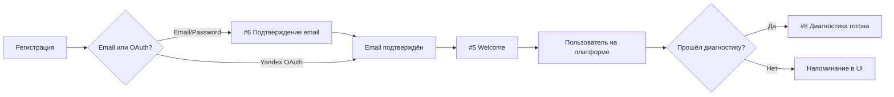
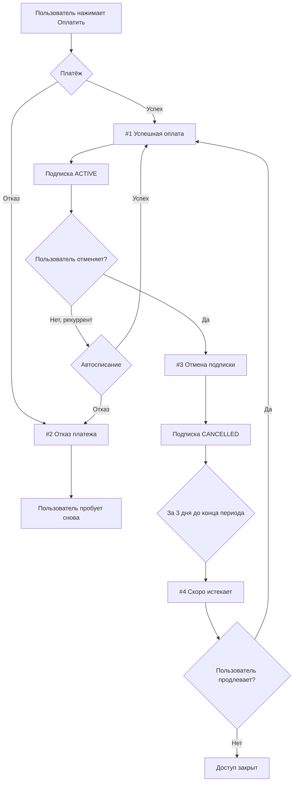
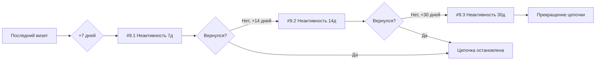

# EMAIL-SPEC: Транзакционные email-уведомления MPSTATS Academy

**Проект:** MPSTATS Academy Adaptive Learning
**Дата:** 2026-03-13
**Версия:** 1.0
**Назначение:** Спецификация для email-команды — шаблоны, переменные, триггеры, flow-схемы
**Провайдер:** Carrot Quest

**Email отправителя:** `noreply@mpstats.academy`
**Имя отправителя:** MPSTATS Academy

**Брендинг:**
- Основной цвет: `#3B82F6` (mp-blue)
- Логотип MPSTATS Academy в header каждого письма
- Footer: ссылка на платформу, контакты, unsubscribe (где применимо)

---

## Оглавление

1. [Billing: Успешная оплата](#1-успешная-оплата)
2. [Billing: Отказ платежа](#2-отказ-платежа)
3. [Billing: Отмена подписки](#3-отмена-подписки)
4. [Billing: Скоро истекает](#4-скоро-истекает)
5. [Auth: Welcome](#5-welcome)
6. [Auth: Подтверждение email](#6-подтверждение-email)
7. [Auth: Сброс пароля](#7-сброс-пароля)
8. [System: Неактивность (цепочка)](#8-неактивность-цепочка)
9. [Flow-схемы](#flow-схемы)
10. [Сводная таблица для Carrot Quest](#сводная-таблица-для-carrot-quest)
11. [Инструкция для email-команды](#инструкция-для-email-команды)

---

## Общие переменные

| Переменная | Описание | Пример |
|------------|----------|--------|
| `{{name}}` | Имя пользователя (из профиля) | Алексей |
| `{{email}}` | Email пользователя | user@example.com |
| `{{platform_url}}` | URL платформы | https://platform.mpstats.academy |

---

## 1. Успешная оплата

| Параметр | Значение |
|----------|----------|
| **Тип** | Billing |
| **CQ Event** | `$payment_success` |
| **Триггер** | Успешный платёж (webhook от CloudPayments, тип `pay`) |
| **Кому** | Пользователю, совершившему оплату |

### Subject

```
Оплата подтверждена — доступ к курсу «{{course_name}}» активирован
```

### Тело письма

```
Здравствуйте, {{name}}!

Ваш платёж успешно обработан. Спасибо за доверие!

Детали платежа:
- Курс: {{course_name}}
- Сумма: {{amount}} руб.
- Период доступа: до {{period_end}}

Доступ к материалам курса уже открыт — вы можете начать обучение прямо сейчас.

[Перейти к обучению]

Если у вас возникнут вопросы, мы всегда на связи.

С уважением,
Команда MPSTATS Academy
```

### CTA

| Текст кнопки | URL |
|--------------|-----|
| Перейти к обучению | `{{platform_url}}/learn` |

### Переменные

| Переменная | Источник | Тип |
|------------|----------|-----|
| `{{name}}` | UserProfile.name | string |
| `{{course_name}}` | Course.title | string |
| `{{amount}}` | Payment.amount (форматирование: `1 490`) | string |
| `{{period_end}}` | Subscription.currentPeriodEnd (формат: `15 апреля 2026`) | string |
| `{{platform_url}}` | env NEXT_PUBLIC_SITE_URL | string |

---

## 2. Отказ платежа

| Параметр | Значение |
|----------|----------|
| **Тип** | Billing |
| **CQ Event** | `$payment_failed` |
| **Триггер** | Неуспешный платёж (webhook от CloudPayments, тип `fail`) |
| **Кому** | Пользователю, чей платёж не прошёл |

### Subject

```
Платёж не прошёл — обновите данные карты
```

### Тело письма

```
Здравствуйте, {{name}}!

К сожалению, ваш платёж за курс «{{course_name}}» не был обработан.

Возможные причины:
- Недостаточно средств на карте
- Карта заблокирована или истёк срок действия
- Банк отклонил транзакцию

Пожалуйста, проверьте данные карты и попробуйте оплатить снова.

[Попробовать снова]

Если проблема сохраняется, свяжитесь с вашим банком или напишите нам — мы поможем разобраться.

С уважением,
Команда MPSTATS Academy
```

### CTA

| Текст кнопки | URL |
|--------------|-----|
| Попробовать снова | `{{platform_url}}/pricing` |

### Переменные

| Переменная | Источник | Тип |
|------------|----------|-----|
| `{{name}}` | UserProfile.name | string |
| `{{course_name}}` | Course.title | string |
| `{{platform_url}}` | env NEXT_PUBLIC_SITE_URL | string |

---

## 3. Отмена подписки

| Параметр | Значение |
|----------|----------|
| **Тип** | Billing |
| **CQ Event** | `$subscription_cancelled` |
| **Триггер** | Пользователь отменил подписку (tRPC `billing.cancelSubscription`) |
| **Кому** | Пользователю, отменившему подписку |

### Subject

```
Подписка отменена — доступ сохранится до {{access_until}}
```

### Тело письма

```
Здравствуйте, {{name}}!

Ваша подписка на курс «{{course_name}}» успешно отменена.

Важно: вы сохраняете полный доступ к материалам курса до {{access_until}}. После этой даты доступ к видеоурокам будет ограничен.

Вы можете возобновить подписку в любой момент — все ваши данные и прогресс обучения сохранятся.

[Возобновить подписку]

Нам жаль, что вы уходите. Если у вас есть обратная связь — мы будем рады её услышать.

С уважением,
Команда MPSTATS Academy
```

### CTA

| Текст кнопки | URL |
|--------------|-----|
| Возобновить подписку | `{{platform_url}}/pricing` |

### Переменные

| Переменная | Источник | Тип |
|------------|----------|-----|
| `{{name}}` | UserProfile.name | string |
| `{{course_name}}` | Course.title | string |
| `{{access_until}}` | Subscription.currentPeriodEnd (формат: `15 апреля 2026`) | string |
| `{{platform_url}}` | env NEXT_PUBLIC_SITE_URL | string |

---

## 4. Скоро истекает

| Параметр | Значение |
|----------|----------|
| **Тип** | Billing |
| **CQ Event** | `$subscription_expiring` |
| **Триггер** | За 3 дня до окончания периода, ТОЛЬКО для подписок со статусом `CANCELLED` |
| **Кому** | Пользователю с отменённой подпиской, у которой заканчивается оплаченный период |

### Subject

```
Через 3 дня истечёт доступ к курсу «{{course_name}}»
```

### Тело письма

```
Здравствуйте, {{name}}!

Напоминаем, что ваш доступ к курсу «{{course_name}}» истекает {{access_until}}.

После этой даты видеоуроки курса станут недоступны. Ваш прогресс обучения и результаты диагностики сохранятся.

Чтобы продолжить обучение без перерыва, возобновите подписку сейчас.

[Продлить доступ]

С уважением,
Команда MPSTATS Academy
```

### CTA

| Текст кнопки | URL |
|--------------|-----|
| Продлить доступ | `{{renew_url}}` |

### Переменные

| Переменная | Источник | Тип |
|------------|----------|-----|
| `{{name}}` | UserProfile.name | string |
| `{{course_name}}` | Course.title | string |
| `{{access_until}}` | Subscription.currentPeriodEnd (формат: `15 апреля 2026`) | string |
| `{{renew_url}}` | `{{platform_url}}/pricing` | string |
| `{{platform_url}}` | env NEXT_PUBLIC_SITE_URL | string |

---

## 5. Welcome

| Параметр | Значение |
|----------|----------|
| **Тип** | Auth |
| **CQ Event** | `$user_registered` |
| **Триггер** | Успешная регистрация пользователя (после подтверждения email или OAuth) |
| **Кому** | Новому пользователю |

### Subject

```
Добро пожаловать в MPSTATS Academy!
```

### Тело письма

```
Здравствуйте, {{name}}!

Добро пожаловать в MPSTATS Academy — образовательную платформу для селлеров маркетплейсов.

Что вас ждёт:
- AI-диагностика навыков — определим ваш текущий уровень за 10 минут
- Персональный трек обучения — только то, что вам действительно нужно
- 400+ видеоуроков от экспертов MPSTATS

Начните с AI-диагностики — она определит ваши сильные стороны и покажет, на чём стоит сфокусироваться.

[Пройти диагностику]

Если появятся вопросы — мы всегда рады помочь.

С уважением,
Команда MPSTATS Academy
```

### CTA

| Текст кнопки | URL |
|--------------|-----|
| Пройти диагностику | `{{diagnostic_url}}` |

### Переменные

| Переменная | Источник | Тип |
|------------|----------|-----|
| `{{name}}` | UserProfile.name (или "пользователь" если не задано) | string |
| `{{diagnostic_url}}` | `{{platform_url}}/diagnostic` | string |
| `{{platform_url}}` | env NEXT_PUBLIC_SITE_URL | string |

---

## 6. Подтверждение email

| Параметр | Значение |
|----------|----------|
| **Тип** | Auth |
| **CQ Event** | — (вызывается через Supabase Send Email Hook или напрямую при регистрации) |
| **Триггер** | Регистрация через email/password (замена стандартного Supabase письма) |
| **Кому** | Пользователю, зарегистрировавшемуся через email |

### Subject

```
Подтвердите ваш email — MPSTATS Academy
```

### Тело письма

```
Здравствуйте, {{name}}!

Для завершения регистрации, пожалуйста, подтвердите ваш email-адрес.

[Подтвердить email]

Ссылка действительна в течение 24 часов.

Если вы не регистрировались на MPSTATS Academy, просто проигнорируйте это письмо.

С уважением,
Команда MPSTATS Academy
```

### CTA

| Текст кнопки | URL |
|--------------|-----|
| Подтвердить email | `{{confirm_url}}` |

### Переменные

| Переменная | Источник | Тип |
|------------|----------|-----|
| `{{name}}` | Имя из формы регистрации (или "пользователь") | string |
| `{{confirm_url}}` | Supabase confirmation URL (из Send Email Hook payload) | string |

---

## 7. Сброс пароля

| Параметр | Значение |
|----------|----------|
| **Тип** | Auth |
| **CQ Event** | — (вызывается через Supabase Send Email Hook или напрямую) |
| **Триггер** | Запрос сброса пароля (страница /forgot-password) |
| **Кому** | Пользователю, запросившему сброс |

### Subject

```
Сброс пароля — MPSTATS Academy
```

### Тело письма

```
Здравствуйте, {{name}}!

Мы получили запрос на сброс пароля для вашего аккаунта.

[Сбросить пароль]

Ссылка действительна в течение 1 часа.

Если вы не запрашивали сброс пароля, просто проигнорируйте это письмо — ваш пароль останется прежним.

С уважением,
Команда MPSTATS Academy
```

### CTA

| Текст кнопки | URL |
|--------------|-----|
| Сбросить пароль | `{{reset_url}}` |

### Переменные

| Переменная | Источник | Тип |
|------------|----------|-----|
| `{{name}}` | UserProfile.name (или "пользователь") | string |
| `{{reset_url}}` | Supabase password reset URL (из Send Email Hook payload) | string |

---

## 8. Неактивность (цепочка)

Цепочка из 3 писем для пользователей, которые не заходили на платформу.

### 9.1. Неактивность 7 дней

| Параметр | Значение |
|----------|----------|
| **Тип** | System |
| **CQ Event** | `$inactive_7d` |
| **Триггер** | 7 дней без визита на платформу (по lastActivityAt) |
| **Кому** | Пользователю, не заходившему 7 дней |

#### Subject

```
{{name}}, мы заметили, что вас давно не было
```

#### Тело письма

```
Здравствуйте, {{name}}!

Вы не заходили на MPSTATS Academy уже неделю. Ваш прогресс обучения ждёт вас!

Последняя активность: {{last_activity}}

Продолжите обучение — даже 15 минут в день помогут значительно продвинуться в навыках продаж на маркетплейсах.

[Продолжить обучение]

С уважением,
Команда MPSTATS Academy
```

#### CTA

| Текст кнопки | URL |
|--------------|-----|
| Продолжить обучение | `{{platform_url}}/learn` |

---

### 9.2. Неактивность 14 дней

| Параметр | Значение |
|----------|----------|
| **Тип** | System |
| **CQ Event** | `$inactive_14d` |
| **Триггер** | 14 дней без визита на платформу |
| **Кому** | Пользователю, не заходившему 14 дней |

#### Subject

```
Ваш трек обучения ждёт — вернитесь в MPSTATS Academy
```

#### Тело письма

```
Здравствуйте, {{name}}!

Прошло уже две недели с вашего последнего визита на платформу. Ваш персональный трек обучения по-прежнему доступен.

Последняя активность: {{last_activity}}

Мы понимаем, что времени не всегда хватает. Но даже один урок в неделю поможет не терять набранный темп.

[Вернуться к обучению]

С уважением,
Команда MPSTATS Academy
```

#### CTA

| Текст кнопки | URL |
|--------------|-----|
| Вернуться к обучению | `{{platform_url}}/dashboard` |

---

### 9.3. Неактивность 30 дней

| Параметр | Значение |
|----------|----------|
| **Тип** | System |
| **CQ Event** | `$inactive_30d` |
| **Триггер** | 30 дней без визита на платформу |
| **Кому** | Пользователю, не заходившему 30 дней |

#### Subject

```
Мы скучаем — вернитесь и продолжите обучение
```

#### Тело письма

```
Здравствуйте, {{name}}!

Вы не заходили на MPSTATS Academy уже месяц. Мы сохранили весь ваш прогресс и результаты диагностики.

Что нового на платформе:
- Ваш персональный трек обучения по-прежнему актуален
- AI-ассистент готов ответить на ваши вопросы по урокам

Если у вас изменились задачи или интересы — пройдите диагностику заново, и мы обновим ваш трек.

[Вернуться на платформу]

Если вы больше не хотите получать такие письма, нажмите «Отписаться» ниже.

С уважением,
Команда MPSTATS Academy
```

#### CTA

| Текст кнопки | URL |
|--------------|-----|
| Вернуться на платформу | `{{platform_url}}/dashboard` |

### Общие переменные цепочки неактивности

| Переменная | Источник | Тип |
|------------|----------|-----|
| `{{name}}` | UserProfile.name | string |
| `{{last_activity}}` | UserProfile.lastActivityAt (формат: `5 марта 2026`) | string |
| `{{platform_url}}` | env NEXT_PUBLIC_SITE_URL | string |

---

## Flow-схемы

### Registration Flow



### Billing Flow



### Inactivity Flow



---

## Сводная таблица для Carrot Quest

| # | CQ Event | Шаблон | Переменные | Тип |
|---|----------|--------|------------|-----|
| 1 | `$payment_success` | Успешная оплата | name, course_name, amount, period_end | Billing |
| 2 | `$payment_failed` | Отказ платежа | name, course_name | Billing |
| 3 | `$subscription_cancelled` | Отмена подписки | name, course_name, access_until | Billing |
| 4 | `$subscription_expiring` | Скоро истекает | name, course_name, access_until, renew_url | Billing |
| 5 | `$user_registered` | Welcome | name, diagnostic_url | Auth |
| 6 | — (Supabase Hook) | Подтверждение email | name, confirm_url | Auth |
| 7 | — (Supabase Hook) | Сброс пароля | name, reset_url | Auth |
| 8.1 | `$inactive_7d` | Неактивность 7д | name, last_activity | System |
| 8.2 | `$inactive_14d` | Неактивность 14д | name, last_activity | System |
| 8.3 | `$inactive_30d` | Неактивность 30д | name, last_activity | System |

---

## Инструкция для email-команды

### Что нужно сделать

1. **Создать triggered messages** в Carrot Quest, привязанные к event names из таблицы выше
2. **Сверстать шаблоны** по драфтам текстов из этого документа
3. **Подставить переменные** в формате Carrot Quest (могут отличаться от `{{var}}` -- уточнить в CQ docs)
4. **Настроить цепочку неактивности** как автоматизацию с условиями по дням

### Требования к дизайну

| Параметр | Значение |
|----------|----------|
| Основной цвет | `#3B82F6` (синий MPSTATS) |
| Акцентный цвет | `#10B981` (зелёный, для success-сообщений) |
| Цвет предупреждений | `#F59E0B` (жёлтый, для expiring/failed) |
| Шрифт | System font stack (Arial, Helvetica, sans-serif) |
| Логотип | В header каждого письма (получить у дизайнера) |
| Ширина | 600px max-width, адаптивный |
| Footer | Ссылка на платформу + Отписаться (для цепочки неактивности) |

### Приоритет реализации

1. **Высокий:** #1 Успешная оплата, #5 Welcome, #6 Подтверждение email, #7 Сброс пароля
2. **Средний:** #2 Отказ платежа, #3 Отмена подписки
3. **Низкий:** #4 Скоро истекает, #8 Неактивность (цепочка)

### Важные замечания

- Письма #6 и #7 (подтверждение email, сброс пароля) заменяют стандартные письма Supabase Auth. Они будут вызываться через Supabase Send Email Hook, а не через CQ event -- переменные `{{confirm_url}}` и `{{reset_url}}` приходят из Supabase
- Письмо #4 (скоро истекает) отправляется ТОЛЬКО для подписок со статусом CANCELLED (не для активных -- у них автопродление)
- Цепочка неактивности (#9) прерывается при любом визите пользователя на платформу
- Все суммы в рублях, даты в формате `15 апреля 2026` (без точки после года)

---

*Документ подготовлен для передачи email-команде.*
*Техническая интеграция CQ API -- следующий план фазы 22.*
